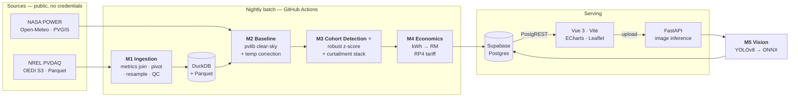

# ARCHITECTURE.md — SolaraX

> **How SolaraX is built, module by module.** Decisions carry their rationale and the alternatives
> rejected. Design rationale for the contested calls lives in
> [`ARCHITECTURE-PLAN.md`](./ARCHITECTURE-PLAN.md); product intent in [`PRD.md`](./PRD.md); sourced
> claims in [`RESEARCH.md`](./RESEARCH.md).
>
> **Version 1.0 — 16 Aug 2026.** Written against **verified** data (§1), not against documentation.
> This document is also the submission architecture artifact.

**Labelling.** Every component is marked **BUILT** (runs on real data today) · **SIMULATED** (real
method, synthetic input, labelled on screen) · **PLANNED** (designed, not yet implemented).
As of 16 Aug 2026 the data layer is verified and every module is **PLANNED**.

---

## 1. The data, as actually verified

Everything below was checked directly against `s3://oedi-data-lake/pvdaq/` on 16 Aug 2026 with no
AWS credentials. **Three findings contradict our own documentation and one of them changes the
demo fleet.**

### 1.1 Access — confirmed

| Check | Result |
|---|---|
| Bucket publicly listable, no credentials | ✅ `HTTP 200` on anonymous `list-type=2` |
| Prefixes | `pvdaq/parquet/` · `pvdaq/csv/` · `pvdaq/2023-solar-data-prize/` |
| Parquet tables | `pvdata` `site` `system` `inverters` `meters` `metrics` `modules` `mount` `other-instruments` |
| Time-series path | `pvdaq/parquet/pvdata/system_id=<id>/year=<y>/month=<m>/day=<d>/system_<id>__date_<y>_<m>_<d>.snappy.000.parquet` |
| Site list | `pvdaq/csv/systems_20250729.csv` — 1,862 rows, 26 real columns + 5 empty `Unnamed:` columns |
| Toolchain | `pandas 3.0.5` + `pyarrow 25.0.1` install cleanly on **Python 3.14.5** |

### 1.2 🔴 Finding 1 — only 157 systems have downloadable data, not 1,862

`DATASETS.md` §2.1 reports clusters of **136 / 118 / 99** systems in California. Those counts come
from the **metadata CSV**. Enumerating `pvdata/` shows **157 `system_id` prefixes** actually carry
time-series Parquet — of which **30 pass NREL's QA and have coordinates.**

**There is no 136-site California cohort to download.** The `site`/`system`/`metrics` Parquet tables
independently corroborate this: 157–160 rows each.

### 1.3 🔴 Finding 2 — the data is long-format EAV, not a wide table

A day of one system is **not** columns like `ac_power`. It is:

| column | dtype | meaning |
|---|---|---|
| `measured_on` | `datetime64[ns]` | local timestamp |
| `utc_measured_on` | `datetime64[ns]` | UTC timestamp |
| `metric_id` | `int32` | **system-specific** channel id |
| `value` | `float64` | raw reading |

`metric_id` is only meaningful via `pvdaq/parquet/metrics/metrics__system_<id>__part000.parquet`,
which is **per system** and carries `sensor_name, common_name, units, calc_scale, calc_offset,
aggregation_type`. Ingestion **must** join metrics, apply `value * calc_scale + calc_offset`, and
pivot long→wide. Channel naming is inconsistent across systems — `ac_power`, `ac_power_hW`,
`ac_power_1`, `inv1_ac_power` all occur.

One system-day is **~185 KB / 20,160 rows** — that is 1-minute data across ~14 channels, **not the
15-minute interval `TECHNICAL.md` §2 claims.** Resolution varies by system, so resampling to a common
grid is mandatory, not optional.

### 1.4 ✅ Finding 3 — a better fleet exists: greater Las Vegas

> **Superseded, 19 Aug 2026.** What shipped is broader than this section describes: **11 sites across 2 cohorts** — DSUN-01 (5, MD/DE/NJ, `Cfa`) and VEGAS-01 (6, NV, `Bwh`) — not 8 sites in one Las Vegas region. Cross-cohort structure is a gain, not a compromise: it exercises the clustering step and shows the method generalises across weather regions, which a single cohort cannot. A third cohort, GOLDEN-01, was configured and then dropped — it had no time-series data. The analysis below stands as the reasoning that found the fleet; the numbers in it are the 16 Aug plan, not what runs.

The systems that *do* have data are larger and more commercial than the California residential rows.
Grouping the 157 by location and filtering to QA-pass:

| Location | n | QA-pass | median kWp | size |
|---|---|---|---|---|
| **Las Vegas + Henderson, NV** | 8 | **8** | **~135** | **1.22 GB** |
| Golden, CO | 17 | 11 | 6.0 | 43.7 GB |
| Gaithersburg, MD | 4 | 4 | 242.5 | 18.0 GB |
| New Orleans, LA | 60 | 0 | 4.2 | 1.5 GB |

**The demo fleet is greater Las Vegas.** Verified properties:

- **8 QA-pass systems within a 37 km radius** — one desert weather region, comfortably above the
  ≥5-per-cohort minimum (PRD v2 §15)
- **40.6 – 277.2 kWp** — genuine **C&I rooftop scale**, matching PRD v2's stated buyer ("a 300 kWp
  factory roof") far better than 6 kWp residential would
- All five Las Vegas systems are `type = roof`
- **2,552 days of fully concurrent overlap** (2013-05-29 → 2020-05-24)
- Every system has an AC power channel; **systems 1278, 1368, 1369 expose per-inverter channels**
  (up to 9 inverters), which is what makes the *string-level divergence* claim in PRD v2 §4 real
- **1.22 GB** — downloadable on a laptop

Four further Clark County / Henderson systems (QA-fail) extend the fleet to 12 for a MONITOR tier.

> **This is a better story than the original plan, not a worse one.** The fleet is C&I rooftop in a
> single weather region — which is exactly the product's target — instead of Californian houses.

### 1.5 What this changes

| Doc | Claim | Correction |
|---|---|---|
| `DATASETS.md` §2.1 | "136 / 118 / 99 site clusters", "1,564 passing QA" | Metadata-only. **157 systems have data; 30 QA-pass with coords** |
| `DATASETS.md` §6.2 | "confirm volume — 136 systems may be large" | Resolved: the chosen cohort is **1.22 GB** |
| `TECHNICAL.md` §2 | "15-min intervals" | **1-minute** for the systems checked; varies by system |
| `TECHNICAL.md` §2 | implies wide columns | **Long-format EAV**; requires a metrics join and pivot |
| `PRD.md` §8 | "multiple systems in a shared climate zone" | Holds, and exceeded — **2 cohorts, 11 sites, 2 Köppen zones** (`Cfa`, `Bwh`) as shipped |

---

## 2. System diagram



**Read it as one sentence:** public data in, physics baseline, cohort comparison, ringgit out — with
imagery attached only as evidence on sites the electrical signal already flagged.

---

## 3. Modules

### M1 — Fleet Ingestion · PLANNED

**Job.** Turn PVDAQ's per-system EAV Parquet into one canonical, `site_id`-keyed, daily table.

**The five steps that Finding 1.3 forces:**

1. Read `metrics__system_<id>` → map `metric_id` → `sensor_name`
2. Select the AC power channel by **regex**, not exact match (naming is inconsistent)
3. Apply `value * calc_scale + calc_offset`
4. Pivot long → wide on `metric_id`
5. Resample to a common grid and integrate power → energy

```python
# src/ingest/pvdaq.py
import re, io, urllib.request as u
import pandas as pd

BASE = "https://oedi-data-lake.s3.amazonaws.com/pvdaq/parquet"
AC_RE = re.compile(r"^(inv\d+_)?ac_power(_hW|_kW|_\d+)?$", re.I)

def _read(key: str) -> pd.DataFrame:
    return pd.read_parquet(io.BytesIO(u.urlopen(f"{BASE}/{key}").read()))

def channel_map(system_id: int) -> pd.DataFrame:
    """metric_id -> sensor_name, with the scale/offset needed to make it physical."""
    m = _read(f"metrics/metrics__system_{system_id}__part000.parquet")
    return m[["metric_id", "sensor_name", "units", "calc_scale", "calc_offset"]]

def ac_power_day(system_id: int, day: pd.Timestamp) -> pd.Series:
    """One system-day of AC power in W, indexed by local timestamp."""
    key = (f"pvdata/system_id={system_id}/year={day.year}/month={day.month}/day={day.day}/"
           f"system_{system_id}__date_{day.year}_{day.month:02d}_{day.day:02d}.snappy.000.parquet")
    raw = _read(key)
    cm  = channel_map(system_id)

    # prefer a whole-system channel over a per-inverter one
    cand = cm[cm.sensor_name.astype(str).str.match(AC_RE)]
    if cand.empty:
        raise LookupError(f"system {system_id}: no AC power channel")
    whole = cand[~cand.sensor_name.str.contains(r"^inv\d+_", case=False, na=False)]
    row   = (whole if not whole.empty else cand).iloc[0]

    s = raw.loc[raw.metric_id == row.metric_id].set_index("measured_on")["value"]
    return s * row.calc_scale + row.calc_offset          # physical watts

def daily_kwh(power_w: pd.Series) -> float:
    """Integrate power to energy. Interval is inferred, never assumed —
    PVDAQ resolution varies by system (Finding 1.3)."""
    p = power_w.sort_index()
    dt_h = p.index.to_series().diff().dt.total_seconds().div(3600)
    return float((p.shift() * dt_h).sum() / 1000)        # kWh
```

**Canonical schema — frozen. Every downstream module reads only this.**

| column | type | note |
|---|---|---|
| `site_id` | str | `pvdaq:34` — namespaced so a second source can't collide |
| `date` | date | local calendar day |
| `energy_kwh` | float | integrated from power, interval inferred |
| `capacity_kw` | float | `dc_capacity_kW` |
| `latitude` `longitude` `tilt` `azimuth` `timezone` | float/str | for M2 |
| `cohort_id` | str | assigned by M3 |
| `n_samples` `coverage` | int/float | QC — days below `coverage < 0.9` are excluded, not imputed |

**Source adapter interface.** `ingest/base.py` defines `FleetSource.sites()` and
`FleetSource.daily(site_id, start, end)` returning the schema above. PVDAQ is one implementation;
HKUST would be a second (~100 lines). *Rationale: keeps the HKUST gate (§7) a decision, not a rewrite.*

### M2 — Sensor-Free Baseline · PLANNED

**Job.** Expected generation per site-day from satellite weather + system geometry. No pyranometer,
ever — that is the wedge.

```python
# src/baseline/expected.py
import pvlib, pandas as pd

def expected_kwh(site, weather: pd.DataFrame) -> pd.Series:
    """weather: ghi, dni, dhi, temp_air, wind_speed — satellite only."""
    loc = pvlib.location.Location(site.latitude, site.longitude, tz=site.timezone)
    solpos = loc.get_solarposition(weather.index)

    poa = pvlib.irradiance.get_total_irradiance(
        surface_tilt=site.tilt, surface_azimuth=site.azimuth,
        solar_zenith=solpos.apparent_zenith, solar_azimuth=solpos.azimuth,
        dni=weather.dni, ghi=weather.ghi, dhi=weather.dhi)

    cell_t = pvlib.temperature.sapm_cell(
        poa.poa_global, weather.temp_air, weather.wind_speed,
        **pvlib.temperature.TEMPERATURE_MODEL_PARAMETERS["sapm"]["open_rack_glass_glass"])

    # PVWatts DC: linear in POA, with the standard -0.4%/°C temperature coefficient
    dc_w = pvlib.pvsystem.pvwatts_dc(poa.poa_global, cell_t,
                                     pdc0=site.capacity_kw * 1000, gamma_pdc=-0.004)
    ac_w = dc_w * 0.96                      # inverter + system losses, named constant
    hours = pd.Series(ac_w.index, index=ac_w.index).diff().dt.total_seconds().div(3600)
    return (ac_w * hours).resample("D").sum() / 1000     # kWh/day
```

**Hand-checkable by construction.** Every term is one named model: Ineichen–Perez clear sky, SAPM
cell temperature, PVWatts DC. PRD v2 §13.1 requires one site-day to match a hand calculation.

**Free sanity check.** Malaysian systems publish **PR 56–87%**, healthy C&I 75–85%
([`RESEARCH.md`](./RESEARCH.md) §2). A baseline implying a Malaysian PR outside that band is wrong.

### M3 — Fleet Peer Benchmarking ⭐ · PLANNED

**The differentiator.** Everything else is supporting work.

**Step 1 — cohorts.** Greedy geographic clustering at a 55 km radius, minimum 5 members. Greater Las
Vegas forms one cohort of 8 (§1.4). Cohort membership is data, stored and shown — never a black box.

**Step 2 — performance index, then robust divergence.**

```python
# src/cohort/detect.py
import numpy as np, pandas as pd

def performance_index(actual_kwh, expected_kwh):
    """PI = actual / expected. 1.0 means the site is doing what physics says it should."""
    return (actual_kwh / expected_kwh).replace([np.inf, -np.inf], np.nan)

def robust_z(pi: pd.DataFrame) -> pd.DataFrame:
    """Iglewicz-Hoaglin modified z-score of each site against its cohort, per day.
    pi: index=date, columns=site_id (one cohort)."""
    med = pi.median(axis=1)
    mad = (pi.sub(med, axis=0)).abs().median(axis=1)
    mad = mad.replace(0, np.nan)                       # degenerate cohort -> no score
    return 0.6745 * pi.sub(med, axis=0).div(mad, axis=0)

def flag(z: pd.DataFrame, threshold=-3.5, persist_days=10, window=14) -> pd.DataFrame:
    """A site is flagged only if it stays below threshold for `persist_days` of the
    last `window` days. Persistence is what separates a fault from curtailment (S3.4)."""
    breach = (z < threshold)
    return breach.rolling(window, min_periods=window).sum() >= persist_days
```

**Why median/MAD and not mean/standard deviation.** Cohorts are small (5–8 sites). With mean/std a
single large deviation inflates the standard deviation and *masks itself* — the classic
masking/swamping failure. The median and MAD have a 50% breakdown point, so one or two simultaneous
faults cannot hide each other.

**Why the deviation is the whole point.** `(median_cohort − PI_site) × expected_kWh` is the **kWh
lost**, directly. M4 needs that number to produce ringgit. This is the argument that settles the
detector choice — see §6.

**Handling self-consumption curtailment.** C&I rooftops are clipped by on-site load, not only by
faults. Four layers, cheapest first:

| # | Layer | Mechanism |
|---|---|---|
| 1 | **Persistence + recovery** | Curtailment recovers — the shift restarts, the holiday ends. Faults do not. `persist_days` above |
| 2 | **Upper-envelope PI** | Use the p90 of intraday PI, not the mean. Load clipping removes the *peak*; a fault scales the *whole curve* |
| 3 | **Clear-sky-index filter** | `rdtools.filtering.csi_filter` — analyse stable-irradiance periods only |
| 4 | **Clip-plateau masking** | `rdtools.filtering.clip_filter` |

> **Stated limitation.** The Las Vegas systems are unlikely to show much self-consumption clipping,
> so this mitigation is demonstrated against **injected** curtailment (§5), labelled **SIMULATED**.

**The two-sentence answer, for a non-technical judge:**
> *We compare each site against its neighbours in the same weather. If they all drop together it's
> the weather; if one drops alone that's a fault — and the size of the gap tells us how much money
> it's losing.*

**And for the hardest question — "how do you tell a fault from a factory that closed for a week?":**
> *A closed factory recovers when it reopens and a fault doesn't, so we require the divergence to
> persist for several qualifying days before we flag it. We also compare against the clear-sky upper
> envelope rather than average output, because load clipping removes the peak while a fault scales
> the whole curve down.*

**Known blind spot.** If an entire cohort degrades together (regional haze, a bad module batch),
peer comparison sees nothing. M2's absolute baseline catches fleet-wide drift; M3 catches
site-specific faults. That is why both exist.

### M4 — Economic Ranking · PLANNED

kWh lost → **RM/month at risk** → a dispatch threshold. Every constant is named and sourced in
`config/tariff_rp4.yaml` — nothing numeric is buried in code.

```yaml
# config/tariff_rp4.yaml — Malaysian RP4, in force 1 Jul 2025 -> 31 Dec 2027
tariff:
  structure: RP4                     # four-component + AFA, NOT a flat RM/kWh
  source: https://www.mytnb.com.my/business/understand-your-bill/pricing-tariff
  base_total_sen_per_kwh: 45.4       # T1 - widely reported RP4 headline
  components_sen_per_kwh:            # T2 - secondary source, see uncertainty below
    energy: 28.22
    network: 12.85
    capacity: 4.55
  afa_sen_per_kwh: 3.59              # T1 - July 2026
  uncertainty:                       # conclusion must hold at the pessimistic end
    low_sen_per_kwh: 40.0
    high_sen_per_kwh: 49.0
operations:                          # T2 - labelled assumptions, ranges not points
  cost_per_site_visit_rm: {low: 800, mid: 1500, high: 2500}
  dispatch_threshold_rm_per_month: 1500
esg:
  grid_emission_factor_kgco2e_per_kwh: 0.740   # T1 - Energy Commission 2024
```

```python
# src/economics/rank.py
def rm_at_risk(kwh_lost_per_month: float, cfg) -> dict:
    t = cfg["tariff"]
    rate = (t["base_total_sen_per_kwh"] + t["afa_sen_per_kwh"]) / 100      # RM/kWh
    lo   = (t["uncertainty"]["low_sen_per_kwh"] + t["afa_sen_per_kwh"]) / 100
    return {"rm_per_month": kwh_lost_per_month * rate,
            "rm_per_month_pessimistic": kwh_lost_per_month * lo,          # the honest number
            "tco2e_per_month": kwh_lost_per_month * cfg["esg"]["grid_emission_factor_kgco2e_per_kwh"] / 1000}
```

Dispatch when `rm_per_month_pessimistic > cost_per_site_visit_rm.high`. **The recommendation must
survive the worst corner of every assumption**, per PRD v2 §13.5.

> ⚠️ The component split is a **secondary source**, not TNB primary — `ARCHITECTURE-PLAN.md` §1. It
> is shipped as a labelled range for exactly that reason. The `base_total` and AFA figures are T1.

### M5 — Visual Verification · PLANNED · SIMULATED output

YOLOv8 fine-tuned in Colab on the Roboflow thermal set (281 labelled frames), exported to ONNX and
served through FastAPI. Returns `{defect_class, confidence, bbox}` attached to an **already-flagged**
site.

**It is never a detector.** Where imagery is absent the flag stands on electrical evidence alone.
Leading with this would invite comparison to Sitemark and Scopito on their strongest ground —
`CLAUDE.md` names that as an anti-goal. Thermal imaging also cannot reliably detect microcracks;
electroluminescence is the standard. We do not claim otherwise.

### M6 — Dashboard · PLANNED

Vue 3 · Vite · ECharts · Leaflet, deployed to Vercel, public with no login. Four screens (PRD v2 §4).
Screen 2's **cohort overlay** — seven lines tracking together and one diverging — is the single most
persuasive visual in the product and gets disproportionate polish.

**Fleet identity is real.** Screens show actual PVDAQ site IDs and Nevada locations, labelled
**BUILT**, with RP4 tariff applied as the labelled Malaysian projection, plus a separate panel
running M2 on **real satellite weather at real Malaysian coordinates** (`data/pvgis-bukit-raja-klang.json`,
3.08°N 101.44°E). Malaysian site names over American generation data would be fabrication.

### M7 — API · PLANNED

Supabase Postgres holds precomputed results; the frontend reads via PostgREST. Tables are designed as
a contract so the shape survives a runtime change:

| endpoint | returns |
|---|---|
| `GET /fleet` | fleet summary, site list, capacity totals |
| `GET /sites?site_id=eq.<id>` | 90-day actual vs expected, cohort overlay, divergence onset |
| `GET /dispatch?month=eq.<YYYY-MM>` | ranked queue with RM at risk and evidence |
| `GET /cohorts` | membership, method name, parameters |
| `GET /detections?site_id=eq.<id>` | M5 defect classes + confidence |

> 🔴 **Accepted risk.** Supabase free projects **pause after 7 days without an API request**, and an
> unreachable dashboard during judging counts as non-submission. There is no static fallback by
> decision. **The nightly GitHub Action is therefore a single point of failure** and must include an
> explicit keep-alive request, be green before the judging window, and be checked in early September.

### M8 — Reproducibility · PLANNED

```bash
git clone … && cd SolaraX
python -m venv .venv && .venv/bin/pip install -r requirements.txt
.venv/bin/python run.py            # M1 -> M4, ends by writing Supabase
```

Verified today: `pandas 3.0.5` and `pyarrow 25.0.1` install cleanly on Python 3.14.5. RdTools 3.2.1
and pvlib 0.15.2 both declare `>=3.10`. **RdTools pulls a heavy tree** (`xgboost`, `arch`,
`bayesian-filters`, `plotly`, `scikit-learn`, `statsmodels`, `matplotlib`) so its calls sit behind a
thin wrapper — a failed install degrades to a local implementation rather than blocking the pipeline.

---

## 4. Repository layout

```
SolaraX/
├── config/     tariff_rp4.yaml · cohorts.yaml        every commercial constant, named + sourced
├── src/
│   ├── ingest/     base.py (adapter interface) · pvdaq.py [· hkust.py if the gate opens]
│   ├── baseline/   expected.py · rdtools_wrap.py
│   ├── cohort/     cluster.py · detect.py · curtailment.py
│   ├── economics/  rank.py
│   ├── validation/ inject.py · evaluate.py
│   └── publish/    supabase.py
├── api/        FastAPI — image upload + ONNX inference
├── web/        Vue 3 · Vite · ECharts · Leaflet
├── data/       real inputs (PVGIS Bukit Raja) + cached Parquet
├── .github/workflows/nightly.yml    batch refresh + Supabase keep-alive
└── run.py      the one command
```

---

## 5. Validation — designed to expose its own failures

No open dataset labels site-level PV faults, so accuracy comes from **injecting known faults into
real Las Vegas series**. Because we control the injection, the resulting figure is honest.

| Fault | Injection | Magnitude, sourced |
|---|---|---|
| Soiling ramp | `P(t) · (1 − r·days)` | r = 0.47%/day → 10.2%/month ([`RESEARCH.md`](./RESEARCH.md) §3) |
| String dropout | `P(t) · (1 − 1/N)` | N from per-inverter channels (§1.4) |
| Inverter outage | `P(t) → 0` | total |
| Partial shading | time-of-day-localised loss | morning or evening window |
| **Curtailment** | weekday-structured clipping plateau | **the control — must NOT be flagged** |

**Protocol.** Severity laddered **down to the detection floor**, injections placed by seeded script
into sites the developer did not choose, evaluated without the label file in scope.

**Reported metrics.** Precision · recall · median days-to-detect · **false-positive rate on
un-injected sites** — the last is the commercially important one, because a false dispatch costs real
money.

**The obvious attack, and the answer.** *"You found faults you invented."* → We show the **failure
region**. A recall curve that decays to zero at low severity is evidence of an honest test; a flat
100% is evidence of a rigged one. Publishing where the detector stops working is the strongest
available signal that the rest is real.

**Real-world echo, not a validation claim.** The Universiti Malaya study measured **86.74% vs 56.30%
PR on two arrays at the same site in the same weather** ([`RESEARCH.md`](./RESEARCH.md) §2) — a
published Malaysian instance of exactly this divergence. Cite as corroboration, never as our number.

---

## 6. Decisions and rejected alternatives

| # | Decision | Rationale | Rejected, and why |
|---|---|---|---|
| 1 | **Greater Las Vegas as the demo fleet** | 8 QA-pass C&I rooftop sites, 37 km, 2,552 concurrent days, 1.22 GB, per-inverter channels | *California 136-site cluster* — **does not exist as downloadable data** (§1.2). *Golden CO* — 43.7 GB and 1–1153 kWp, too heterogeneous for a cohort |
| 2 | **Robust z-score (median/MAD)** | Deviation *is* the kWh magnitude M4 needs; 50% breakdown point resists masking in a cohort of 8 | *Isolation forest* — returns a rank with **no physical unit**, so a second model would be needed to reach ringgit, and "why was this flagged" has no hand-checkable answer. *Mean/std z-score* — masking in small cohorts |
| 3 | **RdTools for filters/normalisation only** | Best answer to "what's new?": NREL's own normalisation, our cohort layer on top | *`TrendAnalysis` as the spine* — built for multi-year degradation in %/yr, wrong shape for monthly triage. *Pure pvlib* — discards the credibility asset for no schedule gain |
| 4 | **Supabase Postgres** | Approved stack; PostgREST is a real API for free, making the ticketing-integration story true | *Static JSON* — contradicts an approved decision and forfeits the API story. *Static JSON fallback alongside* — declined for a single code path; risk accepted in §M7 |
| 5 | **Vue 3 + Vite** | Chang Zhe's approved stack wins on conflict | *Next.js* — proposed, overruled |
| 6 | **PVDAQ only; HKUST gated on 21 Aug** | The accuracy figure carries Technical Feasibility (25%) and PVDAQ delivers it. HKUST is one campus — no clustering to exercise | *Both now* — a second adapter plus Brick/TTL + SPARQL, unbudgeted in 16 days. Deferred, not abandoned: the adapter interface keeps it ~100 lines |
| 7 | **Real PVDAQ identity + Malaysian baseline panel** | Honest end-to-end; the pilot ask becomes the natural close | *Malaysian names over US data* — fabrication, breaches the data-provenance NFR |
| 8 | **Persistence test as primary curtailment defence** | Curtailment recovers, faults don't — cheapest and strongest discriminator; makes the monthly cadence a feature | *Ignoring curtailment* — PRD v2 §15 names it the hardest problem. *ML classifier* — no labelled curtailment data exists |
| 9 | **Repair-cost-aware ranking excluded** | Deferred by team agreement 14 Aug: needs component-level diagnosis and repair pricing, neither of which exists publicly | Building it silently — it would be invented numbers |

---

## 7. Build order and gates

| Days | Work | Gate |
|---|---|---|
| 16–18 Aug | M1 ingestion + frozen schema; M2 baseline; hand-check one site-day | M2 matches hand calculation |
| 19–21 Aug | M3 cohorts + z-score + curtailment; M4 economics; injection harness ✅ | ~~**21 Aug: HKUST gate**~~ ✅ **Closed 19 Aug — ship PVDAQ.** M2/M3 unbuilt, so the condition failed; HKUST is one campus and cannot exercise cross-cohort clustering |
| 22–24 Aug | Validation run; Supabase load; nightly Action green; Vue dashboard | Real precision/recall figure exists |
| 25–26 Aug | Deck, summary, demo video, this doc → PDF; red-team (PRD v2 §13) | Submission complete |
| 27–31 Aug | Buffer — no new features | Supabase awake, Action green |

**Cut order:** HKUST → M5 classifier → Screen 3 → Screen 4.
**Never cut:** M3's accuracy figure · the one-command run · the nightly keep-alive.

---

## 8. Non-functional requirements

| Requirement | How it is met |
|---|---|
| **Explainability** | Every flag is `z`, `PI`, `expected_kwh`, `kwh_lost` — named method, hand-checkable. **An LLM may explain a score; it never computes one** |
| **Sensor independence** | M2 consumes satellite irradiance only. No module hard-requires a pyranometer |
| **Data provenance** | Real public datasets only. Synthetic parts are fault injection, labelled SIMULATED |
| **Reproducibility** | M1→M4 from one command on a clean machine |
| **Public accessibility** | No login on repo or dashboard during judging |
| **Claim discipline** | Every number traces to [`RESEARCH.md`](./RESEARCH.md). §6 there lists what is not yet safe to ship — notably the IEC 61724-1 satellite clause, which is **parked**; the architecture does not depend on it |

---

## 9. Honest limitations

- **The generation data is American.** It proves the method, not the market. No public per-site
  Malaysian PV time series exists — verified three ways ([`RESEARCH.md`](./RESEARCH.md) §5). The
  Malaysian *weather* half is real; the pilot is the ask.
- **Fault labels are synthetic**, because nothing open ships site-level labels.
- **Curtailment mitigation is demonstrated on injected curtailment**, since the Nevada sites are
  unlikely to exhibit much self-consumption clipping.
- **Cohort logic needs ≥5 sites per weather region.** Below that the control group is too weak. This
  eases as a fleet grows — the scalability story, not a flaw.
- **Correlated cohort-wide failure is invisible to M3.** M2's absolute baseline is the complement.
- **Ranking ignores repair cost** — deferred by team agreement, §6 row 9.
- **The RP4 component split is a secondary source**, shipped as a labelled range.

---

*v1.0 · 16 Aug 2026 · Data verified against `s3://oedi-data-lake/pvdaq/` the same day.*
*Deadline: 31 Aug 2026, 23:59 MYT.*
